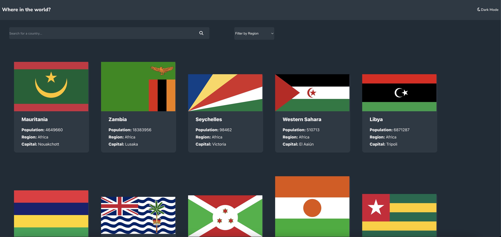

# Frontend Mentor - REST Countries API with color theme switcher solution

This is a solution to the [REST Countries API with color theme switcher challenge on Frontend Mentor](https://www.frontendmentor.io/challenges/rest-countries-api-with-color-theme-switcher-5cacc469fec04111f7b848ca). Frontend Mentor challenges help you improve your coding skills by building realistic projects. 

## Table of contents

- [Overview](#overview)
  - [The challenge](#the-challenge)
  - [Screenshot](#screenshot)
  - [Links](#links)
- [My process](#my-process)
  - [Built with](#built-with)
  - [What I learned](#what-i-learned)
  - [Continued development](#continued-development)
  - [Useful resources](#useful-resources)
- [Author](#author)

## Overview

### The challenge

Users should be able to:

- See all countries from the API on the homepage
- Search for a country using an `input` field
- Filter countries by region
- Click on a country to see more detailed information on a separate page
- Click through to the border countries on the detail page
- Toggle the color scheme between light and dark mode *(optional)*

### Screenshot



### Links

- Live Site URL: [View on Netlify](restapicountriessite.netlify.app)

## My process

### Built with

- Semantic HTML5 markup
- CSS custom properties
- Flexbox
- Mobile-first workflow
- [React](https://reactjs.org/) - JS library

### What I learned

This project helped me reinforce my knowledge on React topics like passing down methods as props and changing the state. It also helped me to make shorter CSS by using the min() and max() function, in fact, this project was only made using one breakpoint.
```css

div {
  width: min(10vw, 50px); /* Picks the smallest value */
  margin: max(2rem, 20vh); /* Picks the maximum value */
}

```
```js
render() {
  return <MyComponent method={this.myMethod} />
}
```

### Continued development

- clamp() function in CSS: I understand its basic functionality but I'm not as fluent on it as I'm with min() and max().
- React Function Components: Usually I work with classes but I will probably start using functions as soon as I get comfortable with them.

### Useful resources

- [Kevin Powell CSS videos](https://www.youtube.com/watch?v=bn-DQCifeQQ&t=1512s) - This helped me a lot to make faster and more effective responsive designs. I will keep using this strategy in the future.
- [CSS Tricks](https://css-tricks.com) - Every time I have some doubt with CSS, I always look up for this page!

## Author

- Frontend Mentor - [@Chabulsqu](https://www.frontendmentor.io/profile/Chabulsqu)
- Twitter - [@mateo_fain](https://www.twitter.com/mateo_fain)
- Dev.to - [@Chabulsqu](https://dev.to/chabulsqu)